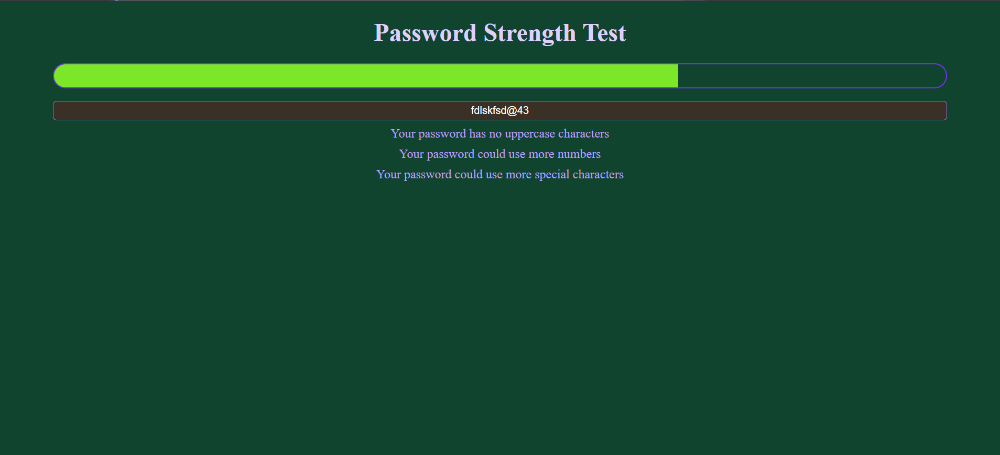

# Password Strength Tester 🔐

A simple **Password Strength Tester** built using  **HTML, CSS, and JavaScript** . It dynamically evaluates the strength of a password based on various criteria such as length, uppercase/lowercase letters, numbers, special characters, and repeated characters.

---

## 🚀 Features

✅ Real-time password strength analysis

✅ Visual strength meter using CSS

✅ Displays improvement suggestions

---

## 📸 [Demo]()



---

## 🛠️ Technologies Used

* **HTML** – Structure of the webpage
* **CSS** – Styling & strength meter visualization
* **JavaScript** – Password strength logic & real-time feedback

---

## 📜 How It Works

1. The user enters a password in the input field.
2. The strength meter dynamically updates based on password quality.
3. Weaknesses are detected based on:
   * **Length**
   * **Uppercase & lowercase letters**
   * **Numbers**
   * **Special characters**
   * **Repetitive characters**
4. Suggestions appear to improve password security.

---

## 🚀 Usage

1. Clone the repository:
   ```sh
   git clone
   ```
2. Navigate to the project folder:
   ```sh
   cd password-strength-tester
   ```
3. Open `index.html` in your browser.

---

## 🎨 Customization

* Modify `style.css` to change the appearance of the strength meter.
* Adjust password strength criteria in `script.js` as per your requirements.

---

## 💡 Future Enhancements

🔹 Implement a password generator feature.

---

## ⭐ Contributing

Contributions are welcome! Feel free to fork the repository, open issues, or submit pull requests.

---


*If you like this project, give it a ⭐ on GitHub!* 🚀
